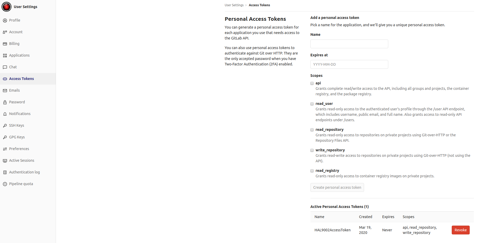
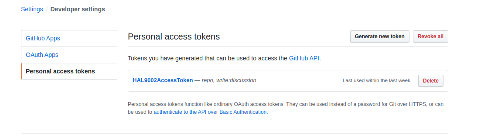
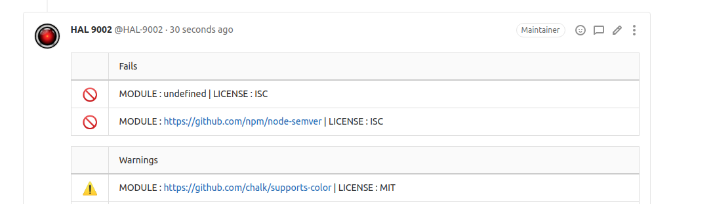
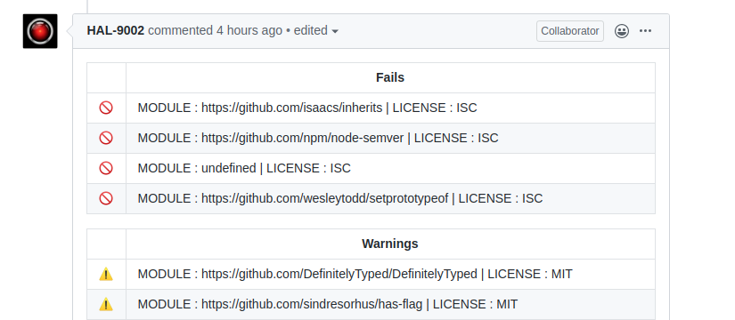

<br/>
<h1 align="center">
  license-auditor
</h1>

<p align="center">
  License Auditor helps you track and validate licenses inside your project.
</p>

<p align="center">
  <strong>
    <a href="https://brainhub.eu/contact/">Hire us</a>
  </strong>
</p>

<div align="center">

  [](https://circleci.com/gh/brainhubeu/license-auditor)
  [](https://github.com/brainhubeu/license-auditor/commits/master)
  [](https://github.com/brainhubeu/license-auditor/blob/master/LICENSE.md)
  [](http://makeapullrequest.com)
  [](https://renovatebot.com/)

  [](https://coveralls.io/github/brainhubeu/license-auditor?branch=master)
  [](https://www.npmjs.com/package/@brainhubeu/license-auditor)
  [](https://github.com/brainhubeu/license-auditor/commits/master)
  [](https://www.npmjs.com/package/@brainhubeu/license-auditor)
  [](https://www.npmjs.com/package/@brainhubeu/license-auditor)
  [](https://github.com/brainhubeu/license-auditor/graphs/contributors)
</div>

License Auditor helps you track and validate licenses inside your project. Prevents unwanted law complications. The license Auditor includes a step in your pipeline and creates notifications about potential problems with used licenses. At the moment, a notification means a comment.

# Getting started

To start using the **License Auditor**, install its package with npm:
```command
npm install license-auditor
```

In the next step, copy `license` directory with `licenses.js`, `blacklist.js`, and `whitelist.js` files. The first one contains a full list of all currently acknowledged, depreciated, and exceptional software licenses. To whitelist or blacklist the license, you must copy selected licenses from the main file into them.

Whitelisting stops **License Auditor** from analyzing and displaying any notifications for a given package with whitelisted license type. Blacklisting a license leads to the generation of fail notification log or causes CI job to fail if the blacklisted license is found, which prevents the developer from merging unwanted dependencies into the destination branch. Any license that is included in neither `blacklist.js` nor `whitelist.js`, but is found during packages analyze or merge request, becomes a warning, which developer should address during merge process or further development.

For **License Auditor** to work, all project dependencies have to be installed before an audit. **License Auditor** iterates through the `node_modules` and retrieves the license information from them. List of licenses is also available at [spdx site](https://spdx.org/licenses/).

# Usage and examples
## Continuous Integration tools adaptation

If you intend to use **License Auditor** with GitLab CI or GitHub Actions, you have to copy [CI example file](./examples/ci_example.js) to the root of your project directory and RENAME it to `dangerfile.js`. This example provides a base for CI-oriented licenses checking using DangerJS (for more information this framework, visit [official Danger Systems site](https://danger.systems/js/)).

Then, you have to include it in your pipeline. The basic structure of **Gitlab** pipeline step should look like this:
```yaml
check_foo_licenses:
  stage: CheckFooLicenses
  image: node:alpine
  script:
    - yarn add -D danger license-auditor
    - yarn danger ci --failOnErrors --id Foo
  variables:
    DANGER_GITLAB_API_TOKEN: $GITLAB_ACCESS_TOKEN
    PROJECT_PATH: $PATH_TO_FOO_PACKAGE # it could look like: ./packages/web or ./server
  only:
    - merge_requests
```
and the basic structure for **Github Actions**:

```yaml
  - name: CheckBarLicenses
        run: |
          yarn add -D danger license-auditor
          yarn danger ci --failOnErrors --verbose --id Bar
        env:
          DANGER_GITHUB_API_TOKEN: ${{ secrets.GITHUB_ACCESS_TOKEN }}
          GITHUB_TOKEN: ${{ secrets.GITHUB_TOKEN }}
          PROJECT_PATH: $PATH_TO_BAR_PACKAGE # it could look like: ./packages/web or ./server
```

You can find more examples in examples directory for [GitLab](./examples/gitlab) and [GitHub](./examples/github).

To allow automatic comments posting on MRs/PRs, you need to create either ```Gitlab Access Token``` or ```Github Access Token``` in a profile that is going to post comments
under MRs/ PRs. Then you need to specify environmental variables with key ```DANGER_GITLAB_API_TOKEN``` or ```DANGER_GITHUB_API_TOKEN``` and value being the acquired token.
The Access Token needs to have the ability to use the Github/Gitlab API and write discussions for MRs/PRs.

#### Gitlab:


#### Github:


In provided examples, the new Gitlab and Github accounts were created to act as a "bot", that was posting MR/PR comments based on license information. Both of them were named [HAL9002](https://en.wikipedia.org/wiki/HAL_9000).

The comments should look similar to:

for Gitlab:



for Github:



You can find more information about Github and Gitlab configuration [here](https://danger.systems/js/guides/getting_started.html).

## Logging tool and own implementation

To use a logging tool instead of CI, copy [logging example file](./examples/logging_example.js) to the root of your project directory. It is intended to log used license information into the console of your preference. To use it, you need to have a JavaScript runtime environment installed (e.g. [Node.js](https://nodejs.org/en/)). Then, just simply type:
```command
node logging_example.js
```
This command will list fails for every dependency that was blacklisted in `blacklist.js` file and warnings for licenses that are missing on both `whitelist.js` and `blacklist.js` files.

You can also create your own implementation of `warn` and `fail` methods behavior based on your needs. To do so, we recommend to copy [logging example file](./examples/logging_example.js) and change `fail` and `warn` methods implementations, remembering to preserve `msg` input parameter and not to add new parameters, as they will be of no use.

## About
`license-auditor` was built using:
- [Danger.js](https://danger.systems/js/)
- [License-Checker](https://github.com/davglass/license-checker)

`license-auditor` is maintained by [@jkthomas](https://github.com/jkthomas), [@nikodemwrona](https://github.com/NikodemWrona) and the Brainhub development team. It is funded by Brainhub and the names and logos for Brainhub are trademarks of Brainhub Sp. z o.o.. You can check other open-source projects supported/developed by our teammates [here](https://brainhub.eu/?utm_source=github).

[](https://brainhub.eu/?utm_source=github)

We love open-source JavaScript software! See our other projects or hire us to build your next web, desktop, and mobile application with JavaScript.
